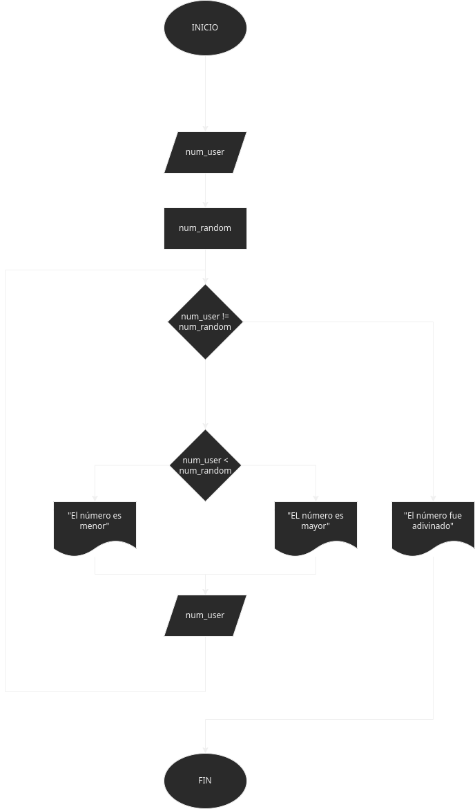

# Ejercicio Adivina el número 
Hacer un programa que genere un número aleatorio sin un rango en concreto

## Análisis:
Usando la libreria random se genera un número aleatorio, este número será comparado con uno introducido por el usuario, esta es la condicion para que salga del bucle si la condicion no se cumple 
se evalua que tan cerca esta el usurio de adivinar el número.

## Diseño:

